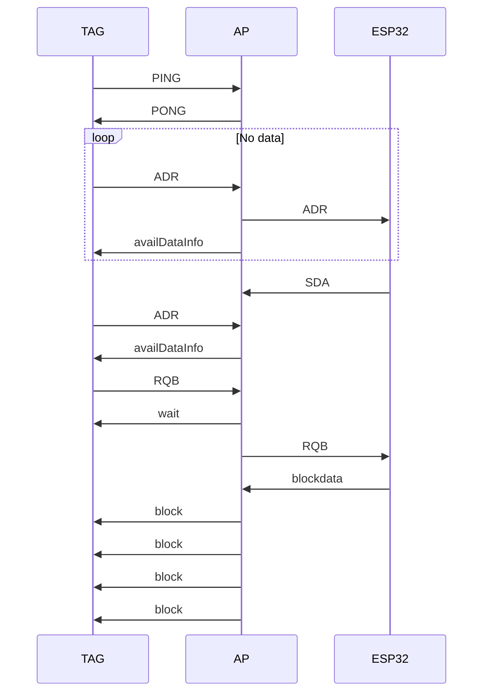

# Sequence diagram of RF and ESP communication

work in progress

Serial connection AP -> ESP32\
ACK> CMD_REPLY_ACK\
NOK> CMD_REPLY_NOK\
NOQ> CMD_REPLY_NOQ\
VER> ZBS_RX_WAIT_VER\
MAC> ZBS_RX_WAIT_MAC\
ZCH> ZBS_RX_WAIT_CHANNEL\
ZPW> ZBS_RX_WAIT_POWER\
PEN> ZBS_RX_WAIT_PENDING\
NOP> ZBS_RX_WAIT_NOP\
TYP> ZBS_RX_WAIT_TYPE\
RES> RX_CMD_RSET\
RQB> ZBS_RX_BLOCK_REQUEST > RX_CMD_RQB\
ADR> ZBS_RX_WAIT_DATA_REQ > RX_CMD_ADR\
XFC> ZBS_RX_WAIT_XFERCOMPLETE > RX_CMD_XFC\
XTO> ZBS_RX_WAIT_XFERTIMEOUT > RX_CMD_XTO\
RDY> RX_CMD_RDY\

RX_CMD_RQB 0x01 BlockRequest processBlockRequest()   The ap ask for data because the tag tag asked for new data\
RX_CMD_ADR 0x02 DataReq processDataReq()      the tag asked if we ave new data?\
RX_CMD_XFC 0x03 XferComplete processXferComplete()    the tag  has requested all data for displaying an image\
RX_CMD_XTO 0x04 XferTimeout processXferTimeout()   the tag took to many tries to fetch the data\
RX_CMD_RDY 0x05\
RX_CMD_RSET 0x06\

ZBS_RX_WAIT_PKT_LEN 1            ?\
ZBS_RX_WAIT_PKT_RX 2             ?\
ZBS_RX_WAIT_SEP1 3               ?\
ZBS_RX_WAIT_SEP2 4               ?\
ZBS_RX_WAIT_VER 6                Version of the AP\
ZBS_RX_BLOCK_REQUEST 7       >   RX_CMD_RQB\
ZBS_RX_WAIT_XFERCOMPLETE 8   >   RX_CMD_XFC\
ZBS_RX_WAIT_DATA_REQ 9       >   RX_CMD_ADR\
ZBS_RX_WAIT_JOINNETWORK 10       ?\
ZBS_RX_WAIT_XFERTIMEOUT 11   >   RX_CMD_XTO\
ZBS_RX_WAIT_MAC 12               Mac of AP\
ZBS_RX_WAIT_CHANNEL 13           Channel of AP\
ZBS_RX_WAIT_POWER 14             AP POWER\
ZBS_RX_WAIT_PENDING 15           ?\
ZBS_RX_WAIT_NOP 16               ?\
ZBS_RX_WAIT_TYPE 17              ?\

CMD_REPLY_WAIT 0x00\
CMD_REPLY_ACK 0x01\
CMD_REPLY_NOK 0x02\
CMD_REPLY_NOQ 0x03\

### IDs for rf packets
| Name                      | Value |
|---------------------------|-------|
| PKT_AVAIL_DATA_SHORTREQ   | 0xE3 |
| PKT_AVAIL_DATA_REQ        | 0xE5 |
| PKT_AVAIL_DATA_INFO       | 0xE6 |
| PKT_BLOCK_PARTIAL_REQUEST | 0xE7 |
| PKT_BLOCK_REQUEST_ACK     | 0xE9 |
| PKT_BLOCK_REQUEST         | 0xE4 |
| PKT_BLOCK_PART            | 0xE8 |
| PKT_XFER_COMPLETE         | 0xEA |
| PKT_XFER_COMPLETE_ACK     | 0xEB |
| PKT_CANCEL_XFER           | 0xEC |
| PKT_PING                  | 0xED |
| PKT_PONG                  | 0xEE |
