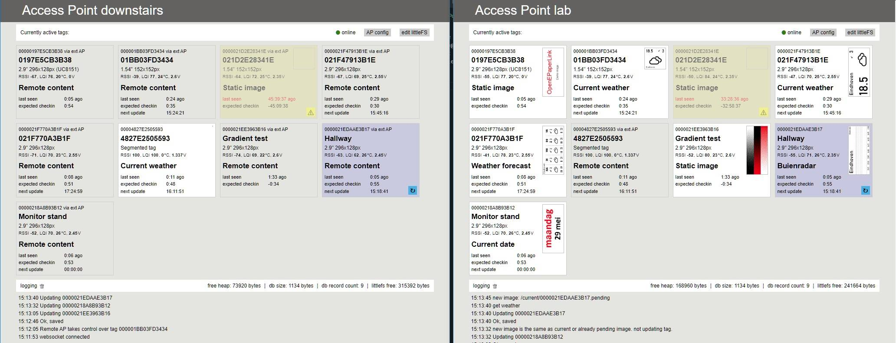

Access Points within the same WiFi network automatically discover each other through UDP multicast and synchronize all tag information. For each tag, there is one AP (of your choice) that generates the content, but the tag receiving the content can be connected to a different AP elsewhere. This allows you to place a few APs in your house to extend the coverage while managing all tags and content from a single AP.

Give it a try!

